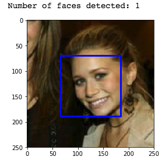
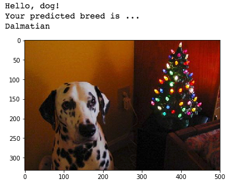
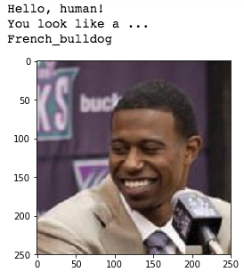
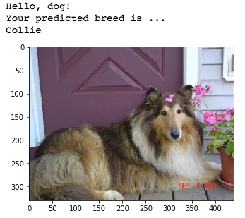

# CNN_Dog_Breed_Classifier

## Motivation

Classify dog breeds and identify human faces using Keras. The code will accept any user-supplied image as input. If a dog is detected in the image, it will provide an estimate of the dog's breed. If a human is detected, it will provide an estimate of the dog breed that is most resembles.

## Dataset

Two datasets, one with 133 different dog breeds (8k images) and one of humans (13k images)

## Detect Humans

After converting sample image to grayscale, used a Haar cascade to identify human faces.

## CNN to Clasify Dog Breeds

Implemented transfer learning classifier using VGG16 and then ResNet50 to improve model performance.

## Results

